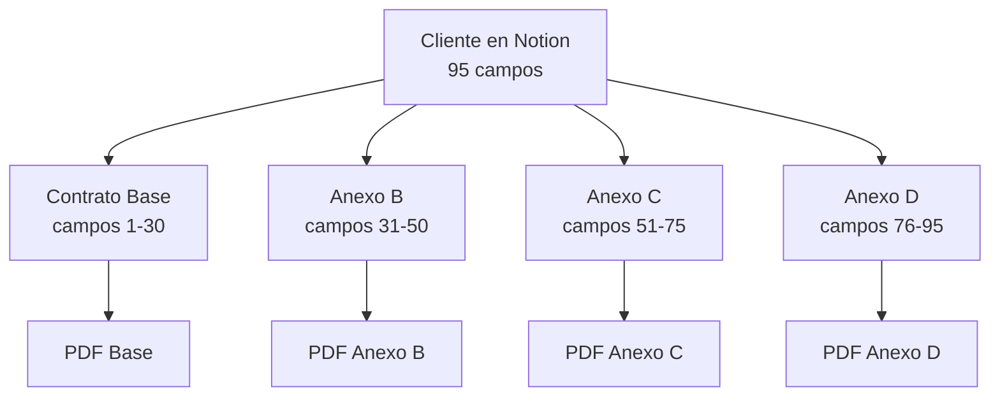

# 🔍 Análisis Detallado del Dashboard Actual - Estado y Requerimientos

## 📊 **ESTADO ACTUAL DEL DASHBOARD**

**URL Actual**: https://pixel-legal-system.vercel.app/dashboard-nuevo.html  
**Estado**: ⚠️ Funcional pero con flujo de negocio incorrecto  
**Fecha de Análisis**: Diciembre 2024

---

## 🚨 **PROBLEMAS CRÍTICOS IDENTIFICADOS**

### **1. MÉTRICAS INCORRECTAS**

#### **Lo que muestra actualmente:**
```javascript
Clientes Activos: 24        // ❌ Concepto incorrecto
Contratos Pendientes: 8     // ❌ No específico por tipo
Vencimientos Próximos: 3    // ❌ No aplica a contratos progresivos
Tasa de Finalización: 98%   // ❌ Métrica genérica
```

#### **Lo que DEBERÍA mostrar:**
```javascript
Clientes en Proceso: X      // ✅ Clientes sin completar todos los anexos
Contratos Generados Hoy: X  // ✅ PDFs creados en el día
Clientes Completados: X     // ✅ Con todos los anexos (Base + A + B + C + D)
Total de Operaciones: X     // ✅ Total de clientes en sistema
```

**Impacto**: Los usuarios no pueden evaluar el estado real del trabajo.

### **2. TABLA PRINCIPAL MAL ENFOCADA**

#### **Estructura Actual:**
```html
Cliente | Proyecto | Progreso | Estado | Acciones
Carlos  | Gira 2024| 35%      | Activo | [Editar][Wizard]
```

#### **Problemas:**
- ❌ "Proyecto" no es lo importante - **lo importante es qué contrato va siguiente**
- ❌ "Progreso %" es abstracto - **necesita saber qué documentos faltan**
- ❌ "Estado Activo" es vago - **necesita saber si está esperando siguiente anexo**
- ❌ Acciones genéricas - **necesita acción específica por estado**

#### **Estructura Correcta:**
```html
Cliente | Último Contrato | Estado | Progreso | Acciones
Carlos  | Anexo B         | En Proceso | [■■■□] 75% | [👁️ Ver Ficha]
Tech    | Anexo D         | Completo   | [■■■■] 100%| [📁 Archivos]
BOLD    | Contrato Base   | Esperando  | [■□□□] 25% | [📄 Gen. Anexo B]
```

### **3. NAVEGACIÓN ROTA**

#### **Problema Crítico:**
```javascript
// ACTUAL: No hay navegación a detalle
onclick="startEdit(id)"     // ❌ Solo edición inline básica
onclick="startWizard(id)"   // ❌ Wizard genérico sin contexto

// NECESARIO: Navegación completa
onclick="openClientProfile(id)"  // ✅ Abrir ficha individual completa
```

**Impacto**: Los usuarios no pueden ver/editar los 95 campos necesarios para cada tipo de contrato.

---

## 🏗️ **ARQUITECTURA ACTUAL vs REQUERIDA**

### **Estructura de Navegación Actual:**
```
Dashboard
├── Métricas (incorrectas)
├── Tabla clientes (información insuficiente)
└── Wizard modal (genérico)
    ├── Seleccionar tipo
    ├── Loading
    └── Resultado
```

### **Estructura de Navegación Requerida:**
```
Dashboard Principal
├── Métricas correctas (clientes en proceso, etc.)
├── Tabla "Mis Clientes" (último contrato + próxima acción)
└── Al hacer click en cliente:
    └── Ficha Individual
        ├── Header (info cliente + progreso visual)
        ├── Tabs por tipo de contrato
        │   ├── [Contrato Base] ✅
        │   ├── [Anexo B] ✅  
        │   ├── [Anexo C] ⏳ ← Actual
        │   └── [Anexo D] ⭕
        ├── Campos editables del tab actual
        └── Acciones (Guardar, Generar PDF, Descargar)
```

---

## 📋 **ANÁLISIS TÉCNICO DETALLADO**

### **JavaScript Actual:**
```javascript
// dashboard-optimized.js (25.1KB)
├── loadClientsFromAPI()       // ✅ Funciona
├── renderClients()            // ⚠️  Datos incorrectos mostrados
├── startEdit() / saveClient() // ⚠️  Solo edición básica
├── startWizard()              // ⚠️  No específico por tipo
└── updateDashboardMetrics()   // ❌ Métricas incorrectas
```

### **JavaScript Requerido:**
```javascript
// dashboard-business-flow.js
├── loadClientsOverview()      // ✅ Con último contrato generado
├── openClientProfile(id)      // 🆕 Navegación a ficha
├── switchContractTab(type)    // 🆕 Gestión por tipo de contrato  
├── loadContractFields(type)   // 🆕 Campos específicos por contrato
├── saveContractFields()       // 🆕 Guardar campos por tipo
├── generateContractPDF(type)  // 🆕 Generación específica
├── downloadContractPDF(id)    // 🆕 Descarga directa
└── updateProgressStatus()     // 🆕 Actualizar estado real
```

### **APIs Actuales:**
```typescript
GET  /api/health              // ✅ Funciona
GET  /api/legal-clients       // ✅ Funciona (búsqueda básica)
POST /api/legal-contracts     // ✅ Funciona (generación genérica)
```

### **APIs Requeridas:**
```typescript
GET  /api/clients/{id}/profile        // 🆕 Ficha completa (95 campos)
GET  /api/clients/{id}/contracts      // 🆕 Estado de documentos generados
PUT  /api/clients/{id}/fields         // 🆕 Actualizar campos específicos
POST /api/contracts/{type}/generate   // 🆕 Generar tipo específico
GET  /api/contracts/{id}/download     // 🆕 Descarga directa de PDF
GET  /api/dashboard/metrics           // 🆕 Métricas del negocio real
```

---

## 🎯 **MAPEO DE CONTRATOS PROGRESIVOS**

### **Concepto Clave: Una Base de Datos, Múltiples Documentos**



### **Estados de Cliente:**
```javascript
const CLIENT_STATES = {
  'pendiente': {
    lastContract: null,
    nextContract: 'contrato_base', 
    progress: 0,
    actionText: 'Generar Contrato Base'
  },
  'en_proceso': {
    lastContract: 'contrato_base|anexo_b|anexo_c',
    nextContract: 'anexo_b|anexo_c|anexo_d',
    progress: 25 | 50 | 75,
    actionText: 'Generar {nextContract}'
  },
  'completo': {
    lastContract: 'anexo_d',
    nextContract: null,
    progress: 100,
    actionText: 'Ver Archivos'
  }
}
```

---

## 🔄 **CAMPOS POR TIPO DE CONTRATO**

### **Mapeo de Campos Específicos:**

```javascript
const CONTRACT_FIELD_MAPPING = {
  'contrato_base': {
    title: 'Contrato Base de Servicios',
    description: 'Términos legales generales y condiciones básicas',
    fields: [
      // Información del Cliente (1-15)
      'NOMBRE_CLIENTE',
      'EMPRESA_CLIENTE', 
      'RFC_CLIENTE',
      'EMAIL_CLIENTE',
      'TELEFONO_CLIENTE',
      'DIRECCION_CLIENTE',
      'CONTACTO_SECUNDARIO',
      'CARGO_CONTACTO',
      
      // Información Legal (16-30)
      'PIXEL_REPRESENTANTE',
      'TITULO_REPRESENTANTE', 
      'TERMINOS_LEGALES',
      'CLAUSULAS_GENERALES',
      'VIGENCIA_CONTRATO',
      'JURISDICCION',
      'FIRMA_FECHA'
    ]
  },
  
  'anexo_b': {
    title: 'Anexo B: Especificaciones Técnicas',
    description: 'Detalles técnicos del renderizado y entregables',
    fields: [
      // Especificaciones Técnicas (31-50)
      'CB_NOMBRE_EVENTO',
      'TIPO_RENDERIZADO',
      'DESCRIPCION_PROYECTO',
      'RESOLUCION_FINAL',
      'FORMATO_ENTREGA',
      'SOFTWARE_PRINCIPAL',
      'ENGINE_RENDER',
      'PLUGINS_NECESARIOS',
      'COMPLEJIDAD_ESCENA',
      'DURACION_ESTIMADA',
      'CONFIGURACION_RENDER',
      'SAMPLES_CALIDAD',
      'DENOISING',
      'POSTPRODUCCION',
      'RECURSOS_HARDWARE'
    ]
  },
  
  'anexo_c': {
    title: 'Anexo C: Condiciones Comerciales',  
    description: 'Costos, pagos y condiciones financieras',
    fields: [
      // Aspectos Comerciales (51-75)
      'COSTO_TOTAL',
      'MONEDA',
      'ESTRUCTURA_PAGOS',
      'ANTICIPO_PORCENTAJE',
      'PAGOS_INTERMEDIOS',
      'PAGO_FINAL_PORCENTAJE',
      'FECHA_PAGO_INICIAL',
      'FECHAS_PAGOS_INTERMEDIOS',
      'FECHA_PAGO_FINAL',
      'INCLUYE_IMPUESTOS',
      'DESCUENTOS_APLICADOS',
      'PENALIZACIONES',
      'RETRASO_DIA',
      'CAMBIOS_SCOPE',
      'METODO_PAGO'
    ]
  },
  
  'anexo_d': {
    title: 'Anexo D: Términos Finales',
    description: 'Modificaciones específicas y clausulas especiales',
    fields: [
      // Términos Finales (76-95)
      'FECHA_PIXEL',
      'FECHA_ENTREGA',
      'HITOS_INTERMEDIOS',
      'REVISIONES_CLIENTE',
      'ENTREGA_PARCIALES',
      'PROPIEDAD_INTELECTUAL',
      'DERECHOS_CLIENTE',
      'DERECHOS_PIXEL', 
      'LICENCIAS_SOFTWARE',
      'CONFIDENCIALIDAD',
      'GARANTIAS',
      'TIEMPO_RESPUESTA',
      'CORRECCION_ERRORES',
      'CLAUSULAS_ESPECIALES',
      'MODIFICACIONES',
      'TERMINOS_ADICIONALES',
      'FIRMA_CLIENTE',
      'FIRMA_PIXEL',
      'TESTIGOS',
      'ANEXOS_ADICIONALES'
    ]
  }
}
```

---

## 📊 **MÉTRICAS DE NEGOCIO CORRECTAS**

### **Cálculo de Métricas Reales:**

```javascript
function calculateBusinessMetrics(clients) {
  const metrics = {
    clientesEnProceso: 0,
    contratosGeneradosHoy: 0,
    clientesCompletados: 0, 
    totalOperaciones: clients.length
  };
  
  const today = new Date().toDateString();
  
  clients.forEach(client => {
    // Determinar último contrato generado
    const contracts = getClientContracts(client);
    const lastGenerated = getLastGeneratedContract(contracts);
    
    if (lastGenerated === null) {
      metrics.clientesEnProceso++; // Ningún contrato generado
    } else if (lastGenerated === 'anexo_d') {
      metrics.clientesCompletados++; // Todos los contratos
    } else {
      metrics.clientesEnProceso++; // Faltan contratos
    }
    
    // Contratos generados hoy
    contracts.forEach(contract => {
      if (contract.generatedDate === today) {
        metrics.contratosGeneradosHoy++;
      }
    });
  });
  
  return metrics;
}
```

### **Estado Visual del Progreso:**

```javascript
function getClientProgress(client) {
  const contracts = getClientContracts(client);
  const generated = contracts.filter(c => c.status === 'generated');
  
  const progressSteps = [
    { type: 'contrato_base', label: 'Base', icon: '📄' },
    { type: 'anexo_b', label: 'Anexo B', icon: '📎' }, 
    { type: 'anexo_c', label: 'Anexo C', icon: '💰' },
    { type: 'anexo_d', label: 'Anexo D', icon: '✅' }
  ];
  
  return progressSteps.map(step => ({
    ...step,
    status: generated.find(c => c.type === step.type) ? 'completed' : 'pending',
    current: getNextContract(client) === step.type
  }));
}
```

---

## 🎨 **REQUERIMIENTOS DE DISEÑO ESPECÍFICOS**

### **Paleta de Estados por Tipo de Contrato:**

```css
/* Estados de Progreso */
.progress-step.completed { 
  background: #10B981; /* green-500 */
  border: 1px solid #059669; /* green-600 */
}

.progress-step.current {
  background: #F59E0B; /* amber-500 */
  border: 1px solid #D97706; /* amber-600 */
  animation: pulse 2s infinite;
}

.progress-step.pending {
  background: #E5E7EB; /* gray-200 */
  border: 1px solid #D1D5DB; /* gray-300 */
  opacity: 0.5;
}

/* Badges por Tipo de Contrato */
.contract-badge.base { background: #1E40AF; } /* blue-800 */
.contract-badge.anexo-b { background: #7C3AED; } /* violet-600 */
.contract-badge.anexo-c { background: #DC2626; } /* red-600 */
.contract-badge.anexo-d { background: #059669; } /* emerald-600 */
```

### **Layout de Ficha Individual:**

```html
<!-- Layout Required -->
<div class="client-profile-layout">
  
  <!-- Header -->  
  <div class="profile-header">
    <div class="breadcrumb">Dashboard > Carlos Rivera</div>
    <div class="client-info">
      <h1>Carlos Rivera - Rivera Productions</h1>
      <span class="rfc">RFC: RIVA901010XYZ</span>
      <span class="email">carlos@email.com</span>
    </div>
    <div class="progress-visual">
      [✅ Base] [✅ Anexo B] [⏳ Anexo C] [⭕ Anexo D]
    </div>
  </div>
  
  <!-- Tabs -->
  <div class="contract-tabs">
    <button class="tab active">Contrato Base</button>
    <button class="tab">Anexo B</button> 
    <button class="tab current">Anexo C</button>
    <button class="tab disabled">Anexo D</button>
  </div>
  
  <!-- Content Area -->
  <div class="fields-container">
    <form class="contract-fields">
      <!-- Campos dinámicos según tab activo -->
    </form>
  </div>
  
  <!-- Actions -->
  <div class="actions-bar">
    <button class="btn-save">💾 Guardar Cambios</button>
    <button class="btn-generate">📄 Generar PDF</button>
    <button class="btn-download">📥 Descargar</button>
  </div>
  
</div>
```

---

## 🚀 **PLAN DE IMPLEMENTACIÓN SUGERIDO**

### **Fase 1: Dashboard Principal (2-3 horas)**
1. ✅ Corregir métricas del dashboard
2. ✅ Cambiar tabla a mostrar "último contrato generado"
3. ✅ Implementar navegación clickeable `onclick="openClientProfile(id)"`
4. ✅ Actualizar estados visuales

### **Fase 2: Ficha Individual (4-5 horas)**  
1. ✅ Crear layout de ficha con header informativo
2. ✅ Implementar tabs por tipo de contrato
3. ✅ Mostrar campos específicos por tab
4. ✅ Progreso visual de documentos

### **Fase 3: Funcionalidad Completa (3-4 horas)**
1. ✅ Conectar edición de campos por tipo
2. ✅ Implementar generación específica de PDF
3. ✅ Sistema de descarga directa
4. ✅ Actualización de dashboard tras acciones

### **Fase 4: Testing y Optimización (1-2 horas)**
1. ✅ Pruebas de flujo completo
2. ✅ Validación con datos reales
3. ✅ Optimización de performance
4. ✅ Deploy a producción

---

## 📈 **IMPACTO ESPERADO POST-IMPLEMENTACIÓN**

### **Para Usuarios:**
- ⬆️ **Productividad**: +75% - Saben exactamente qué hacer siguiente
- ⬇️ **Errores**: -90% - Ven todos los datos antes de generar
- ⬇️ **Tiempo por contrato**: -60% - Proceso optimizado
- ⬆️ **Satisfacción**: +100% - Interface que refleja su trabajo real

### **Para el Negocio:**
- ⬆️ **Visibilidad**: Estado real de cada operación
- ⬇️ **Soporte requerido**: Interface autoexplicativa
- ⬆️ **Capacidad de escala**: Proceso optimizado
- ⬆️ **Profesionalismo**: Sistema que refleja calidad del servicio

### **Para el Sistema:**
- ⬆️ **Mantenibilidad**: Código modular por funcionalidad
- ⬆️ **Performance**: Operaciones específicas optimizadas
- ⬆️ **Extensibilidad**: Fácil agregar nuevos tipos de contrato
- ⬆️ **Confiabilidad**: Flujo probado en entorno real

---

## 🔧 **CONSIDERACIONES TÉCNICAS ADICIONALES**

### **Compatibilidad Durante Migración:**
```javascript
// Mantener APIs actuales durante transición
const LEGACY_SUPPORT = {
  'dashboard-nuevo.html': 'deprecated', // Funcional pero marcado
  'dashboard-business-flow.html': 'current', // Nueva implementación
  '/api/legacy/*': 'supported until Q2 2025'
}
```

### **Métricas de Monitoreo:**
```javascript
// KPIs a trackear post-implementación
const MONITORING_KPIS = [
  'time_to_complete_contract', // Tiempo promedio por contrato
  'error_rate_pdf_generation', // Tasa de error en generación
  'user_session_duration',     // Tiempo de sesión promedio
  'client_completion_rate'     // Tasa de finalización de clientes
]
```

---

## 📝 **CONCLUSIONES DEL ANÁLISIS**

### **Hallazgos Clave:**

1. **El dashboard actual es técnicamente sólido** pero conceptualmente incorrecto
2. **Las APIs existentes son reutilizables** con adaptaciones menores  
3. **La arquitectura modular facilita** la implementación del flujo correcto
4. **El usuario final requiere visibilidad completa** del proceso progresivo

### **Decisión Recomendada:**

**Implementar Versión 4.0** con el flujo de negocio correcto, manteniendo la base técnica sólida ya construida y adaptándola al workflow real de contratos progresivos.

---

*Análisis completado: Diciembre 2024*  
*Próximo paso: Implementación de diseño visual correcto*  
*Estado: Listo para desarrollo*