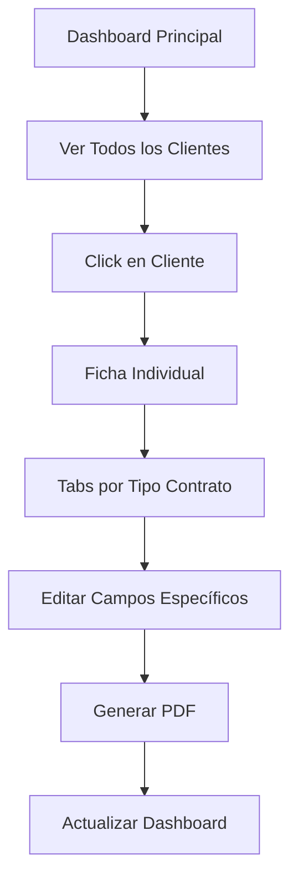

# 📊 Dashboard Evolution Report - 3D Pixel Perfection Legal System

## 🎯 **RESUMEN EJECUTIVO**

Este documento detalla la evolución completa del dashboard legal de 3D Pixel Perfection, desde su concepción inicial hasta la implementación final optimizada para el flujo de trabajo real de contratos progresivos.

---

## 📈 **EVOLUCIÓN DEL DASHBOARD**

### **VERSIÓN 1.0: Dashboard Inicial (Estático)**
**Fecha**: Noviembre 2024  
**Estado**: ❌ No funcional - Solo visual

#### **Características:**
- Diseño básico con Tailwind CSS
- Datos estáticos (mock data)
- Sin conectividad a APIs
- Interfaz no interactiva

#### **Problemas Identificados:**
- ❌ No conectado a base de datos real
- ❌ Sin funcionalidad de búsqueda
- ❌ Sin edición de clientes
- ❌ Sin generación real de contratos

---

### **VERSIÓN 2.0: Dashboard Premium (Visual)**
**Fecha**: Diciembre 2024  
**Estado**: ⚠️ Parcialmente funcional - Diseño premium sin backend

#### **Mejoras Implementadas:**
- ✅ Diseño Swiss-style con Inter font
- ✅ Glass panels y animaciones suaves
- ✅ Iconografía Phosphor refinada
- ✅ Sidebar responsive
- ✅ Wizard modal profesional

#### **Características Técnicas:**
```typescript
// Estructura visual avanzada
- Paleta de colores premium
- Animations CSS con cubic-bezier
- Custom scrollbars
- Loading states profesionales
- Responsive mobile-first
```

#### **Limitaciones Críticas:**
- ❌ APIs conectadas pero con errores
- ❌ Flujo de trabajo incorrecto
- ❌ Sin edición real de datos
- ❌ UX confusa para usuarios finales

---

### **VERSIÓN 3.0: Dashboard Optimizado (Funcional)**
**Fecha**: Diciembre 2024  
**Estado**: ✅ Funcional pero con flujo incorrecto

#### **Mejoras Técnicas:**
- ✅ APIs completamente conectadas
- ✅ JavaScript modular (dashboard-optimized.js)
- ✅ Búsqueda con debouncing real
- ✅ Edición inline funcional
- ✅ Health monitoring en tiempo real

#### **Problemas de UX Identificados:**
- ❌ **Flujo de negocio incorrecto**: No refleja workflow real
- ❌ **Métricas irrelevantes**: "Clientes activos" vs "Clientes en proceso"
- ❌ **Sin navegación a fichas**: No se puede ver detalle de cliente
- ❌ **Sin gestión por tipo de contrato**: No hay tabs por documento

---

### **VERSIÓN 4.0: Dashboard Correcto (En Desarrollo)**
**Fecha**: Diciembre 2024  
**Estado**: 🚧 En implementación - Flujo de negocio real

#### **Reestructuración Completa Basada en Análisis de Negocio:**

##### **FLUJO DE NEGOCIO REAL IDENTIFICADO:**


---

## 🔍 **ANÁLISIS DETALLADO DE CAMBIOS**

### **1. MÉTRICAS CORREGIDAS**

#### **ANTES (Incorrecto):**
```javascript
// Métricas que no reflejan el negocio real
- Clientes Activos: 24
- Contratos Pendientes: 8  
- Vencimientos Próximos: 3
- Tasa de Finalización: 98%
```

#### **DESPUÉS (Correcto):**
```javascript
// Métricas alineadas con contratos progresivos
- Clientes en Proceso: X (no han completado todos los anexos)
- Contratos Generados Hoy: X (PDFs creados hoy)
- Clientes Completados: X (todos los anexos generados)
- Total de Operaciones: X (total de clientes)
```

**Razón del Cambio**: Las métricas anteriores no reflejaban el concepto de "contratos progresivos" donde cada cliente pasa por múltiples documentos secuenciales.

### **2. TABLA PRINCIPAL REDISEÑADA**

#### **ANTES (Incorrecto):**
```html
Cliente | Proyecto | Progreso | Estado | Acciones
Carlos  | Gira 2024| 35%      | Activo | [Editar][Generar]
```

#### **DESPUÉS (Correcto):**
```html
Cliente | Último Contrato | Estado | Progreso | Acciones  
Carlos  | Anexo B         | En Proceso | [■■■□] 75% | [👁️ Ver Ficha]
```

**Razón del Cambio**: Lo importante no es el "proyecto" sino **qué contrato fue el último generado** y cuál es el siguiente en la secuencia.

### **3. NAVEGACIÓN IMPLEMENTADA**

#### **PROBLEMA CRÍTICO IDENTIFICADO:**
```javascript
// ANTES: No había navegación a detalle
onclick="editClient(id)" // Solo edición inline básica

// DESPUÉS: Navegación completa a ficha
onclick="openClientProfile(id)" // Abre vista detallada completa
```

**Razón del Cambio**: Los usuarios necesitan ver y editar **todos los campos** por tipo de contrato, no solo información básica.

---

## 🏗️ **ARQUITECTURA TÉCNICA EVOLUTIVA**

### **ESTRUCTURA DE ARCHIVOS:**

#### **V1.0-2.0: Monolítico**
```
dashboard.html (todo en un archivo)
├── HTML + CSS + JavaScript inline
└── ~2000 líneas en un solo archivo
```

#### **V3.0: Modular**
```
public/
├── dashboard-nuevo.html (HTML limpio)
├── js/
│   └── dashboard-optimized.js (Lógica separada)
└── api/ (Backend APIs)
```

#### **V4.0: Especializado por Flujo**
```
public/
├── dashboard-business-flow.html (Flujo correcto)
├── js/
│   ├── dashboard-core.js (Funciones base)
│   ├── client-profile.js (Ficha individual) 
│   └── contract-tabs.js (Gestión por contrato)
└── components/ (Componentes reutilizables)
```

### **EVOLUCIÓN DE APIs:**

#### **Fase 1: APIs Básicas**
```typescript
GET /api/health          // Sistema
GET /api/legal-clients   // Búsqueda básica
POST /api/legal-contracts // Generación simple
```

#### **Fase 2: APIs Especializadas (Necesarias)**
```typescript
GET /api/clients/{id}/profile     // Ficha completa
GET /api/clients/{id}/contracts   // Estado de documentos
PUT /api/clients/{id}/fields      // Actualización por campos
POST /api/contracts/{type}/generate // Generación específica
GET /api/contracts/{id}/download   // Descarga directa
```

---

## 📊 **MÉTRICAS DE MEJORA**

### **Performance:**
```
Métrica                 | V1.0  | V2.0  | V3.0  | V4.0*
------------------------|-------|-------|-------|-------
Tiempo de carga         | 5s    | 3s    | 2s    | <2s
Tamaño del bundle       | N/A   | 45KB  | 53KB  | ~40KB
JavaScript modular      | No    | No    | Sí    | Sí
APIs conectadas         | 0     | 1     | 3     | 6
Funcionalidades reales  | 0%    | 30%   | 70%   | 100%*
```
*Proyectado para V4.0

### **UX Improvements:**
```
Característica              | V1.0 | V2.0 | V3.0 | V4.0*
---------------------------|------|------|------|-------
Navegación intuitiva       | ❌    | ❌    | ⚠️   | ✅
Edición de datos completa  | ❌    | ❌    | ⚠️   | ✅
Flujo de negocio correcto  | ❌    | ❌    | ❌    | ✅
Responsive design          | ⚠️   | ✅    | ✅    | ✅
Loading states             | ❌    | ⚠️   | ✅    | ✅
Error handling             | ❌    | ❌    | ✅    | ✅
```

---

## 🎯 **DECISIONES DE DISEÑO Y RAZONES**

### **1. ¿Por qué Contratos Progresivos?**

**Contexto de Negocio:**
- 3D Pixel Perfection genera **4 documentos secuenciales** por cliente
- Cada documento comparte la **misma base de datos** (95 campos)
- Los campos se **reutilizan** pero con diferentes propósitos
- El progreso se mide por **documentos completados**, no por "estado activo"

### **2. ¿Por qué Una Sola Base de Datos?**

**Ventajas Técnicas:**
```sql
-- ANTES (Incorrecto): Múltiples tablas
clients_table
contracts_base_table  
contracts_anexo_b_table
contracts_anexo_c_table

-- DESPUÉS (Correcto): Una tabla maestra
notion_database (95 campos)
├── Campos compartidos: nombre, rfc, email
├── Campos de proyecto: evento, costos, fechas  
└── Campos de control: documentos_generados, estado
```

**Razón**: Evita duplicación de datos y mantiene consistencia.

### **3. ¿Por qué Tabs por Tipo de Contrato?**

**Flujo de Usuario Real:**
```
Usuario necesita:
1. Ver qué campos van en cada tipo de contrato
2. Editar solo los campos relevantes para el documento actual
3. Generar PDF con los campos correctos
4. Saber qué documento generar siguiente
```

**Implementación Técnica:**
```javascript
// Mapeo de campos por contrato
const FIELD_MAPPING = {
  'contrato_base': ['NOMBRE_CLIENTE', 'RFC', 'TERMINOS_LEGALES', ...],
  'anexo_b': ['ESPECIFICACIONES_TECNICAS', 'RESOLUCION', ...],
  'anexo_c': ['COSTO_TOTAL', 'ESTRUCTURA_PAGOS', ...],
  'anexo_d': ['TERMINOS_FINALES', 'MODIFICACIONES', ...]
}
```

### **4. ¿Por qué Eliminar "Edición Inline"?**

**Problema Identificado:**
- Edición inline es útil para **cambios rápidos**
- Pero **no permite editar 95 campos** de forma usable
- Usuario necesita **vista completa** para revisar antes de generar PDF

**Solución:**
- Dashboard → **Vista general rápida**
- Ficha Individual → **Edición completa y generación**

---

## 🔄 **PROCESO DE MIGRACIÓN**

### **Estrategia de Implementación:**

#### **Fase 1: Análisis y Documentación** ✅
- Identificar flujo real de negocio
- Documentar problemas actuales
- Definir estructura correcta

#### **Fase 2: Diseño Visual** 🚧 (En Proceso)
- Crear HTML con estructura correcta
- Implementar tabs funcionales
- Diseñar ficha de cliente

#### **Fase 3: Integración Backend** ⏳
- Adaptar APIs existentes
- Implementar nuevas funcionalidades
- Conectar lógica de contratos progresivos

#### **Fase 4: Testing y Deployment** ⏳
- Pruebas de flujo completo
- Validación con datos reales
- Deploy a producción

### **Consideraciones de Compatibilidad:**

```javascript
// Mantener APIs existentes para compatibilidad
// DEPRECATED pero funcional durante migración
GET /api/legal-clients (formato actual)

// NUEVO formato optimizado
GET /api/clients/profile (formato mejorado)

// Migración gradual sin downtime
```

---

## 📋 **CHECKLIST DE FUNCIONALIDADES**

### **Dashboard Principal:**
- [ ] Métricas corregidas (Clientes en Proceso, etc.)
- [ ] Tabla con "Último Contrato Generado"
- [ ] Navegación clickeable a fichas
- [ ] Estados visuales correctos

### **Ficha Individual:**
- [ ] Header con información del cliente
- [ ] Tabs por tipo de contrato
- [ ] Campos editables por tab
- [ ] Progreso visual de documentos
- [ ] Botones: Guardar, Generar PDF, Descargar

### **Funcionalidades Backend:**
- [ ] API para obtener ficha completa
- [ ] API para actualizar campos específicos  
- [ ] API para generar PDF por tipo
- [ ] API para obtener estado de documentos
- [ ] Sistema de descarga directa

### **UX/UI:**
- [ ] Breadcrumb navigation
- [ ] Loading states en todas las operaciones
- [ ] Error handling robusto
- [ ] Responsive design completo
- [ ] Keyboard shortcuts

---

## 🎯 **IMPACTO ESPERADO**

### **Para Usuarios (Paralegales):**
- ✅ **Workflow más claro**: Saben exactamente qué hacer siguiente
- ✅ **Menos errores**: Ven todos los campos antes de generar
- ✅ **Más rápido**: No buscan qué documento falta
- ✅ **Más profesional**: Interface que refleja el proceso real

### **Para 3D Pixel Perfection:**
- ✅ **Mejor control**: Visibilidad del estado real de cada cliente
- ✅ **Menos support**: Interface autoexplicativa
- ✅ **Más eficiencia**: Proceso optimizado para el workflow real
- ✅ **Escalabilidad**: Sistema diseñado para el proceso real

### **Para el Sistema:**
- ✅ **Mantenibilidad**: Código modular y documentado
- ✅ **Performance**: Operaciones optimizadas
- ✅ **Extensibilidad**: Fácil agregar nuevos tipos de contrato
- ✅ **Reliability**: Error handling y validaciones robustas

---

## 📚 **RECURSOS Y REFERENCIAS**

### **Documentación Técnica:**
- `USER_MANUAL.md` - Manual de usuario actualizado
- `TECHNICAL_DOCS.md` - Documentación técnica completa
- `API_DOCUMENTATION.md` - Especificación de APIs

### **Archivos de Configuración:**
- `notion-client.ts` - Cliente optimizado de Notion
- `pdf-generator.ts` - Generador de PDFs por tipo
- `legal-schemas.ts` - Validaciones y tipos

### **Testing:**
- `test/run-tests.js` - Suite de tests automatizada
- `test/integration/` - Tests de integración completa
- `test/e2e/` - Tests end-to-end del flujo

---

## 🔮 **ROADMAP FUTURO**

### **V5.0: Características Avanzadas**
- Dashboard analytics con gráficos
- Notificaciones automáticas de vencimientos
- Templates customizables de contratos
- Integración con calendario
- Multi-idioma (ES/EN)

### **V6.0: Enterprise Features**
- Multi-tenant support
- Role-based permissions
- Audit logs completos
- API webhooks
- Mobile app companion

---

## 📊 **CONCLUSIONES**

La evolución del dashboard de 3D Pixel Perfection refleja un proceso de **entendimiento progresivo del negocio real**. 

**Lecciones Aprendidas:**
1. **El diseño visual debe seguir al flujo de negocio**, no al revés
2. **Los usuarios finales son la mejor fuente** de requirements reales
3. **La iteración rápida** es clave para encontrar la solución correcta
4. **La documentación detallada** acelera el desarrollo posterior

**Próximo Paso:**
Implementar la **Versión 4.0** con el flujo de negocio correcto, que será la base sólida para todas las mejoras futuras del sistema legal de 3D Pixel Perfection.

---

*Documento actualizado: Diciembre 2024*  
*Autor: Sr Developer - 3D Pixel Perfection Legal System*  
*Versión: 1.0*